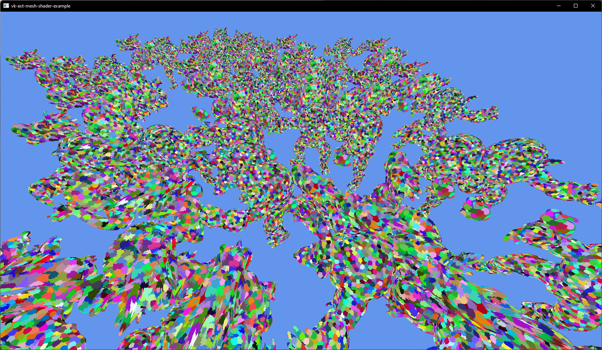

<!-- markdownlint-disable-file MD041 -->
<!-- markdownlint-disable-file MD033 -->

# `🐉 vk-ext-mesh-shader-example`

**Example of a mesh shader with VK_EXT_mesh_shader 🦀**

[![license][license-badge]][license-url]
[![dependency-status][dependency-badge]][dependency-url]

[license-badge]: https://img.shields.io/badge/License-Apache_2.0-blue.svg
[license-url]: LICENSE

[dependency-badge]: https://deps.rs/repo/github/projectkml/vk-ext-mesh-shader-example/status.svg
[dependency-url]: https://deps.rs/repo/github/projectkml/vk-ext-mesh-shader-example

